# MedAI — Medical AI Learning Platform

**Clinical intelligence powered by deep learning** — a full-stack platform for medical imaging, explainable AI, RAG tutoring, symptom checking, textbook study, and interactive 3D anatomy.

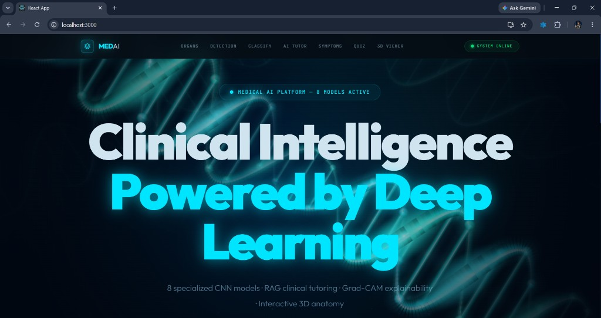

> 8 specialized CNN models · RAG clinical tutoring · Grad-CAM explainability · Study Companion · Interactive 3D anatomy

---

## Overview

MedAI combines computer vision and large-language-model retrieval into one medical learning dashboard. Upload chest X-rays, brain MRIs, skin lesions, and more to get instant predictions with **Grad-CAM heatmaps** that show where the model looked. Ask clinical questions through a **ChromaDB + Mistral RAG** pipeline backed by 88K+ indexed medical chunks. Upload your own textbooks for **per-book chat, quizzes, and exam mode**. Explore **23 real GLB anatomical models** in the browser with Three.js.

Built for students, researchers, and anyone learning radiology, pathology, and physiology — **not for clinical diagnosis**.

---

## Screenshots

### Disease Detection & Grad-CAM

Upload a scan, run inference, and inspect class probabilities alongside a gradient-weighted activation map.

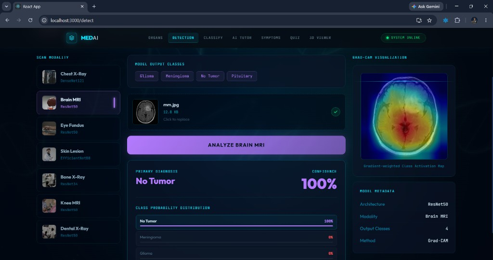

### AI Medical Tutor

Conversational tutoring powered by ChromaDB retrieval and Mistral LLM — ask about radiology, pathology, and clinical imaging.

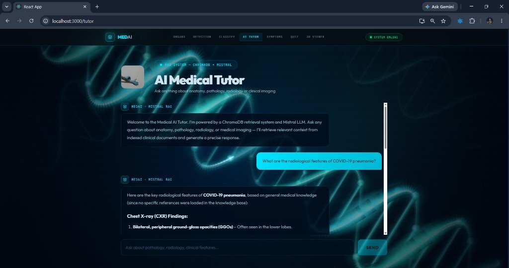

### Medical Knowledge Base

Structured answers on anatomy, physiology, diseases, and treatments with sidebar shortcuts for organs, diseases, and topics.

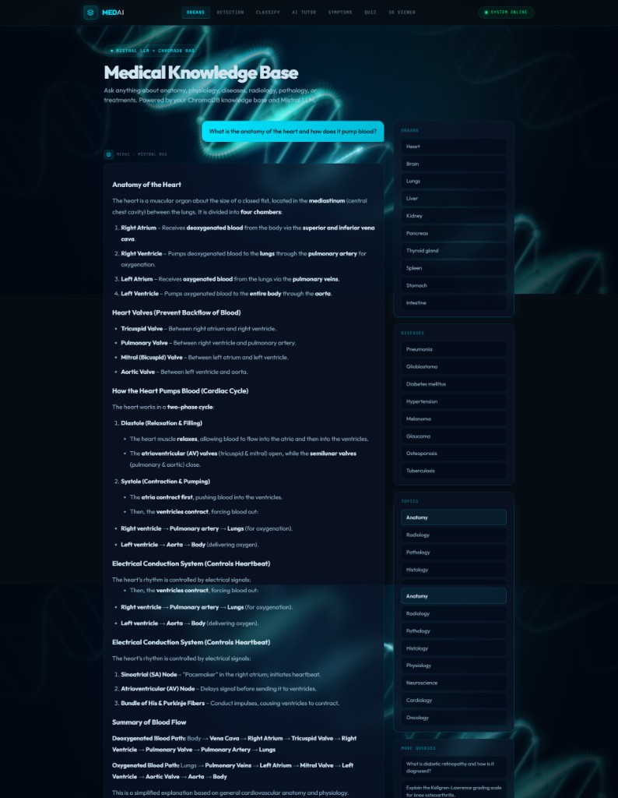

### Symptom Checker

Describe symptoms in plain language and receive a **ranked differential diagnosis** powered by ChromaDB retrieval and Mistral LLM. Each condition opens an interactive clinical education panel with urgency levels, disease overview, management guidance, diagnostics, and red-flag warning signs.

**Example case:** *fever, dry cough, shortness of breath, fatigue* — a classic respiratory presentation. The checker evaluates these against indexed clinical knowledge and returns overlapping differentials common in viral and bacterial lower-respiratory illness, including **COVID-19**, **Influenza**, **Community-Acquired Pneumonia**, **Acute Bronchitis**, **RSV infection**, and **Atypical Pneumonia** (e.g. *Mycoplasma*). Results are for **educational use only** — not confirmed diagnoses.

#### 1. Symptom input

Enter free-text symptoms or pick from example cases. The NLP layer tokenizes input into analyzable symptom tags before RAG retrieval.

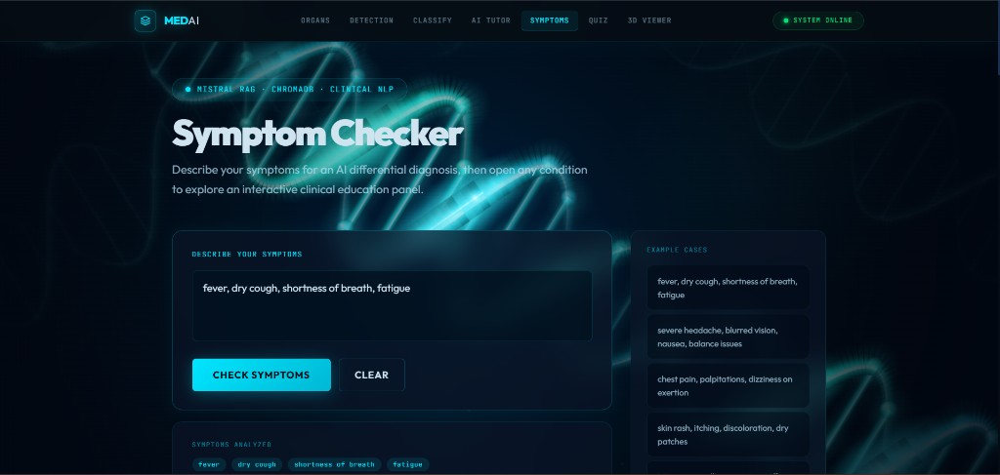

#### 2. Differential diagnosis results

After analysis, the system returns a ranked list of possible conditions with **urgency badges** (Low / Medium / High). COVID-19 (SARS-CoV-2) is surfaced first for this symptom cluster, with hallmark features such as loss of taste/smell and recent exposure noted alongside the clinical summary.

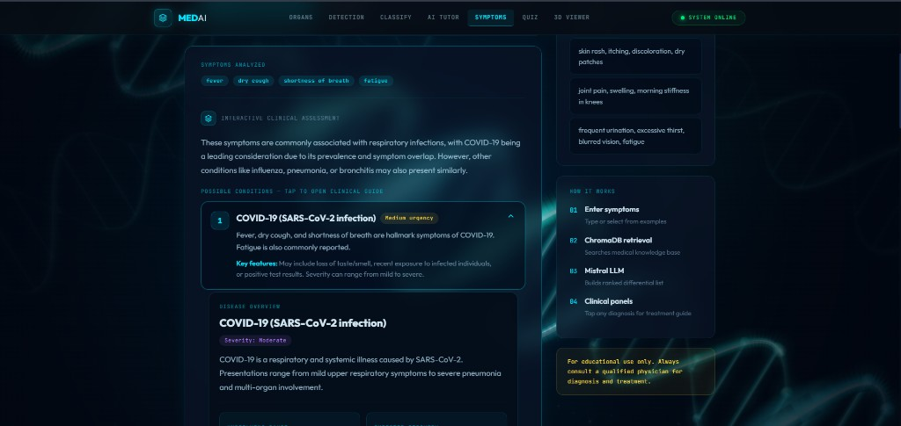

#### 3. Disease overview (COVID-19 panel)

Expanding a diagnosis reveals structured education content: severity grading, pathophysiology (respiratory and systemic illness from SARS-CoV-2), underlying cause (droplet/aerosol transmission), expected recovery timeline, and first-line management including supportive care, antiviral eligibility, and oxygen monitoring for severe cases.

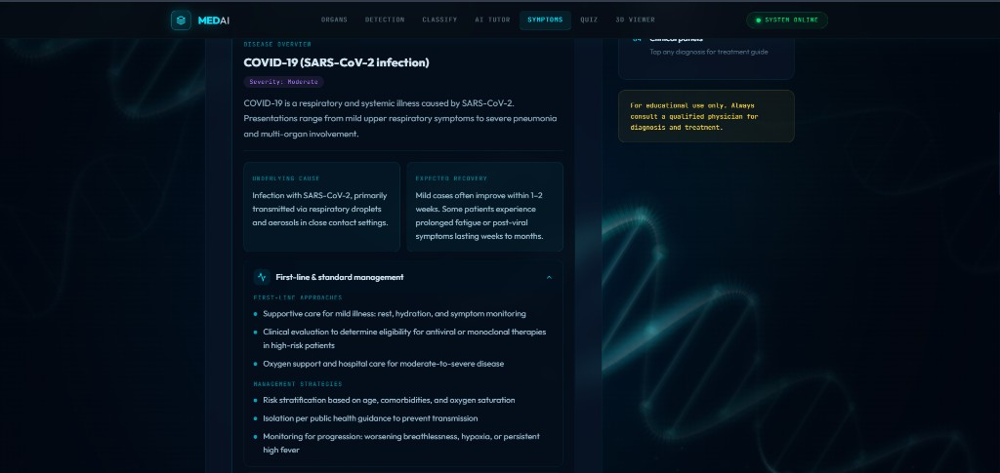

#### 4. Supportive care & medications

Interactive panels cover home guidance (hydration, rest, pulse oximetry, isolation) and **educational** medication categories — antivirals, antipyretics, and bronchodilators — each with appropriate caveats that prescribing requires clinical assessment.

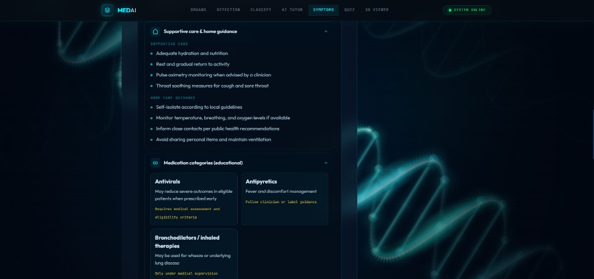

#### 5. Diagnostics, prevention & warning signs

Further panels list confirmatory tests (RT-PCR, rapid antigen, chest imaging when pneumonia is suspected), prevention measures (vaccination, ventilation, hand hygiene), patient education on long COVID, and **red-flag symptoms** requiring urgent care (severe dyspnea, chest pain, confusion, low SpO₂).

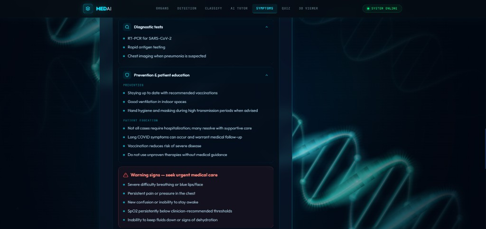

#### 6. Additional ranked conditions

The differential continues with other matches from the same symptom set. **Influenza** is flagged as low urgency (sudden onset, body aches). **Community-Acquired Pneumonia** is flagged as **high urgency** due to productive cough, chest pain, and consolidation signs — illustrating how the checker stratifies risk across similar presentations.

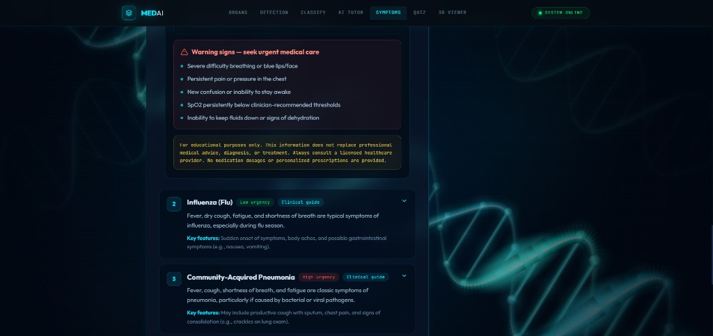

#### 7. Extended differential list

Lower-ranked matches complete the educational differential: **Acute Bronchitis** (persistent post-viral cough), **RSV** (wheezing, higher risk in children and older adults), and **Atypical Pneumonia** (gradual onset, dry cough, headache). A disclaimer reinforces that listed conditions are possibilities, not confirmed diagnoses.

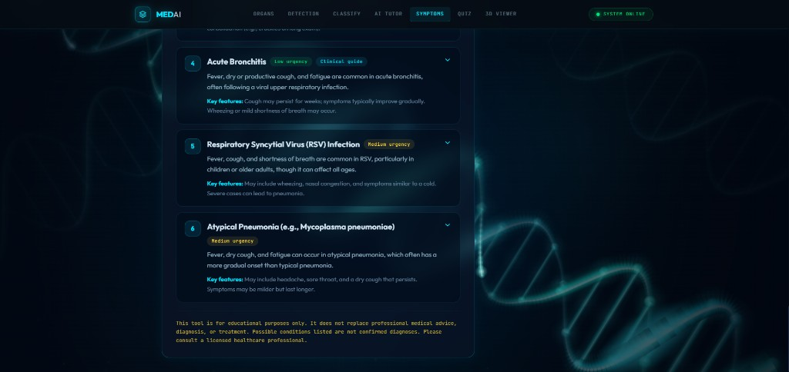

### Imaging Quiz

Test diagnostic skills against the same models used in Detection — organ identification, chest pathology, and brain tumor cases with live accuracy tracking.

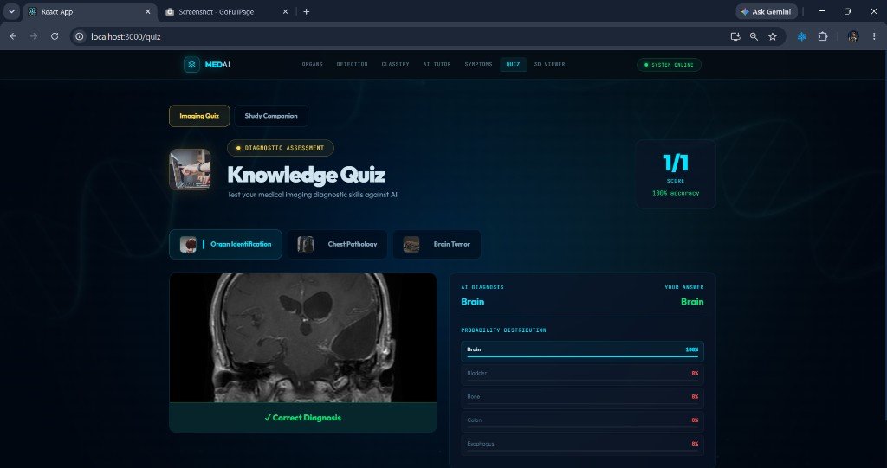

### Study Companion

Upload PDF or text textbooks, index them into per-book vector stores, then chat with citations, generate quizzes, run timed exams, and review analytics.

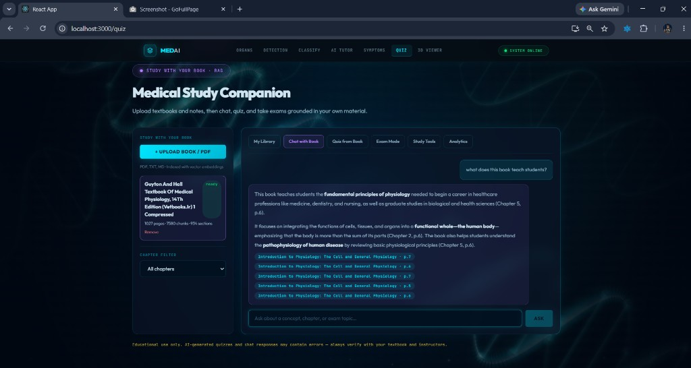

### 3D Anatomy Viewer

Rotate, zoom, and pan 23 medical GLB models filtered by body system — heart, lungs, brain, and more.

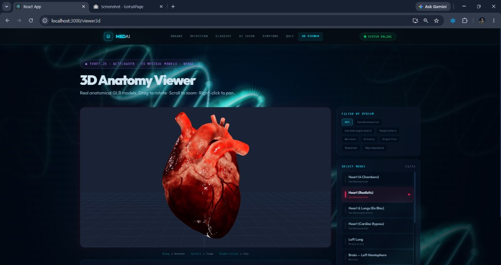

---

## Features

| Module | What it does |
|--------|----------------|
| **Detection** | 7 CNN models — chest X-ray, brain MRI, eye fundus, skin lesion, bone X-ray, knee MRI, dental X-ray |
| **Classify** | 14-class organ classifier + auto pipeline (organ → disease model) |
| **Grad-CAM** | Visual explainability heatmap on every prediction |
| **AI Tutor** | RAG chat over indexed clinical documents (ChromaDB + Mistral) |
| **Knowledge Base** | Broad medical Q&A with organ/disease/topic shortcuts |
| **Symptom Checker** | Structured differential diagnosis with expandable treatment panels |
| **Imaging Quiz** | Gamified diagnostic assessment vs. AI predictions |
| **Study Companion** | Upload textbooks · RAG chat · quiz/exam from your book · analytics |
| **3D Viewer** | Interactive WebGL anatomy (Three.js + GLTFLoader) |

### Detection models

| Scan type | Architecture | Output classes |
|-----------|--------------|----------------|
| Chest X-Ray | DenseNet121 | COVID-19, Pneumonia, TB, Lung Opacity, Normal |
| Brain MRI | ResNet50 | Glioma, Meningioma, No Tumor, Pituitary |
| Eye Fundus | ResNet50 | 9 ocular conditions |
| Skin Lesion | EfficientNetB0 | 7 classes (HAM10000) |
| Bone X-Ray | ResNet34 | Fractured, Normal |
| Knee MRI | ResNet50 | KL Grade 0–4 (osteoarthritis) |
| Dental X-Ray | ResNet50 | 6 dental pathology classes |

---

## Tech stack

| Layer | Technology |
|-------|------------|
| Frontend | React 18, TypeScript, Three.js, Tailwind CSS |
| Backend | FastAPI, PyTorch, Python 3.11+ |
| ML models | ResNet50, DenseNet121, EfficientNetB0, ResNet34 |
| RAG | ChromaDB, Mistral AI, Sentence Transformers |
| Study indexing | Per-book ChromaDB collections, PDF/TXT chunking |
| Clinical data | SQLite (`backend/data/clinical.db`) |
| Asset hosting | Hugging Face Hub (models + medical PDFs) |
| Deployment | Docker Compose |

**Mistral API** (tutor, symptom checker, study chat/quiz): pay-as-you-go — e.g. `mistral-small` ~$0.25 per 1M input tokens.

---

## Quick start (Windows)

```powershell
git clone https://github.com/shayamahmad/med-ai.git
cd med-ai

# One-time setup (venv, npm install, optional HF asset download)
npm run setup

# Add your Mistral key to .env
copy .env.example .env
# Edit .env → MISTRAL_API_KEY=...

# Start backend + frontend
npm start
```

- Frontend: [http://localhost:3000](http://localhost:3000)
- Backend API: [http://localhost:8000](http://localhost:8000)
- Swagger docs: [http://localhost:8000/docs](http://localhost:8000/docs)

Wait for the backend health check before using Study Companion or RAG features. Large textbooks (e.g. Guyton) may take several minutes to index.

### Environment variables

Create `.env` in the project root:

```env
MISTRAL_API_KEY=your_mistral_key_here
HF_ASSETS_REPO=your-username/medai-assets
REACT_APP_API_URL=http://localhost:8000
REACT_APP_HF_ASSETS_REPO=your-username/medai-assets
```

See [`.env.example`](.env.example) for the full list.

---

## Project structure

```
med-ai/
├── backend/
│   ├── main.py                 # FastAPI app
│   ├── startup.py              # Fast init + background model/RAG loading
│   ├── model_loader.py         # CNN model registry
│   ├── gradcam.py              # Grad-CAM heatmaps
│   ├── rag_system.py           # ChromaDB + Mistral RAG
│   ├── symptom_checker.py      # Symptom → structured diagnosis
│   ├── clinical/               # Disease DB + treatment panels API
│   └── study/                  # Study Companion (upload, RAG, quiz, exam)
├── medai-frontend/
│   └── src/
│       ├── pages/              # Home, Detection, Tutor, Quiz, Viewer3D, …
│       ├── components/study/   # Study Companion UI
│       └── api/                # Axios API client
├── docs/screenshots/           # README preview images
├── scripts/                    # setup.ps1, start.ps1, HF asset scripts
├── docker-compose.yml
└── README.md
```

---

## API highlights

| Method | Endpoint | Description |
|--------|----------|-------------|
| GET | `/health` | System health + model status |
| POST | `/classify/*` | Organ + disease classification (7 modalities) |
| POST | `/classify/auto` | Auto organ → disease pipeline |
| POST | `/explain/gradcam` | Grad-CAM heatmap |
| POST | `/rag/query` | Medical knowledge base Q&A |
| POST | `/symptom-check` | Structured differential diagnosis |
| GET | `/clinical/diseases` | Clinical disease library |
| GET | `/study/books` | Study Companion library |
| POST | `/study/books/upload` | Upload textbook (PDF, TXT, MD) |
| POST | `/study/books/{id}/chat` | RAG chat with book citations |
| POST | `/study/books/{id}/quiz` | Generate quiz from book |
| POST | `/study/books/{id}/exam` | Timed exam mode |

Full interactive docs at `/docs`.

---

## Docker deployment

```bash
docker-compose build
docker-compose up -d
```

Backend on port **8000**, frontend on port **3000**. Set `REACT_APP_API_URL` to your server IP in `docker-compose.yml`.

---

## Trained models

| Model | Architecture | Dataset | Classes |
|-------|--------------|---------|---------|
| organ_model_v2 | ResNet50 | Multi-organ | 14 |
| chest_model | DenseNet121 | COVID-19 Radiography | 5 |
| brain_model | ResNet50 | Br35H + Figshare | 4 |
| eye_model | ResNet50 | ODIR-5K | 9 |
| skin_model | EfficientNetB0 | HAM10000 | 7 |
| bone_model | ResNet34 | MURA | 2 |
| knee_model | ResNet50 | OAI + Kaggle KL | 5 |
| dental_model | ResNet50 | Dental Panoramic | 6 |

Models and assets can be hosted on [Hugging Face Hub](https://huggingface.co) (free for public datasets). Use `npm run download:assets` after setting `HF_ASSETS_REPO`.

---

## Disclaimer

This platform is for **educational and research purposes only**. It is not intended for clinical use, medical diagnosis, or treatment decisions. AI-generated quizzes and chat responses may contain errors — always verify with textbooks and qualified instructors.

---

## License

[MIT License](LICENSE) — free to use, modify, and distribute.
